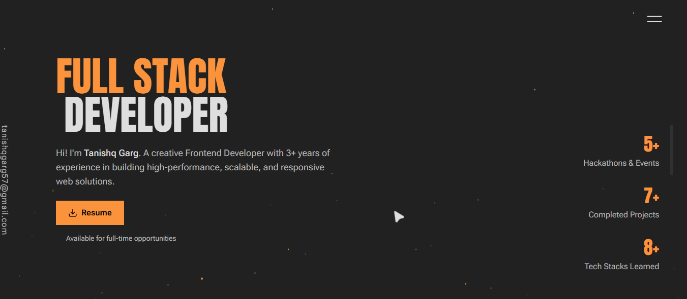

<h1 align="center">
  Hi 👋, I'm Tanishq Garg
</h1>

<h3 align="center">
🚀 Full Stack Web Developer | ☁️ Azure Developer | 🤖 AI Enthusiast
</h3>

  

## 🚀 About Me

- 🎓 B.Tech Student at Arya College of Engineering
- 💻 Full Stack Web Developer
- ☁️ Learning Microsoft Azure & Cloud Technologies
- 🤖 Building AI Powered Applications
- 🌱 Currently Learning Next.js, Azure & Generative AI

## Tech Stack

💻 Languages

⚡ Frameworks & Libraries

🗄️ Databases

☁️ Deployment & Cloud

🛠 Tools & Others

## 🚀 Projects

### 1. Nvidia Ecommerce
**Description:**  
A full-stack e-commerce platform built with React, Node.js, Express, and MongoDB. Features product listings, shopping cart functionality, user authentication, and a responsive user interface.

🔗 Live Demo: [Add Link Here](#)  
💻 GitHub: [Add Repository Link Here](#)

#### Screenshot

---

### 2. Care Connect
**Description:**  
A healthcare management platform designed to connect patients with healthcare providers. Features appointment scheduling, patient record management, doctor listings, and an intuitive user experience for streamlined healthcare services.

🔗 Live Demo: [Add Link Here](#)  
💻 GitHub: [Add Repository Link Here](#)

#### Screenshot

---

### 3. Hotel Landing Page
**Description:**  
A modern and responsive hotel landing page showcasing rooms, amenities, booking options, and customer reviews with an attractive user interface.

🔗 Live Demo: [Add Link Here](#)  
💻 GitHub: [Add Repository Link Here](#)

#### Screenshot

---

### 4. Property Landing Page
**Description:**  
A real estate landing page designed to display premium properties, featured listings, pricing details, and contact information in a professional layout.

🔗 Live Demo: [Add Link Here](#)  
💻 GitHub: [Add Repository Link Here](#)

#### Screenshot

---

### 5. Personal Portfolio
**Description:**  
A personal portfolio website showcasing my skills, projects, certifications, and professional journey with a modern responsive design.

🔗 Live Demo: [Tanishq Garg](https://portfolio-tanishq-garg.vercel.app/)  
💻 GitHub: [Portfolio-Tanishq_Garg](https://github.com/Tanishq1568/Portfolio-Tanishq_Garg)

#### Screenshot

